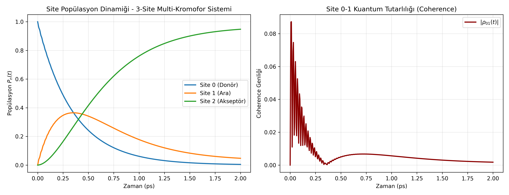
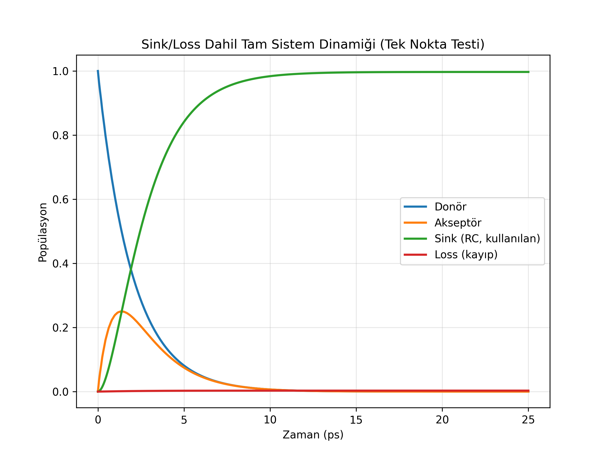
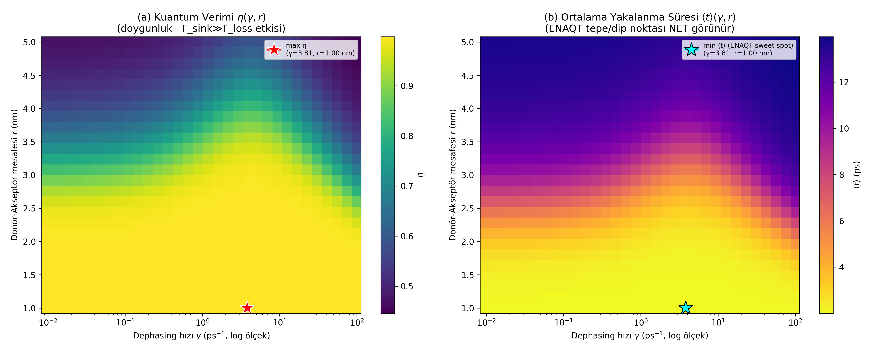
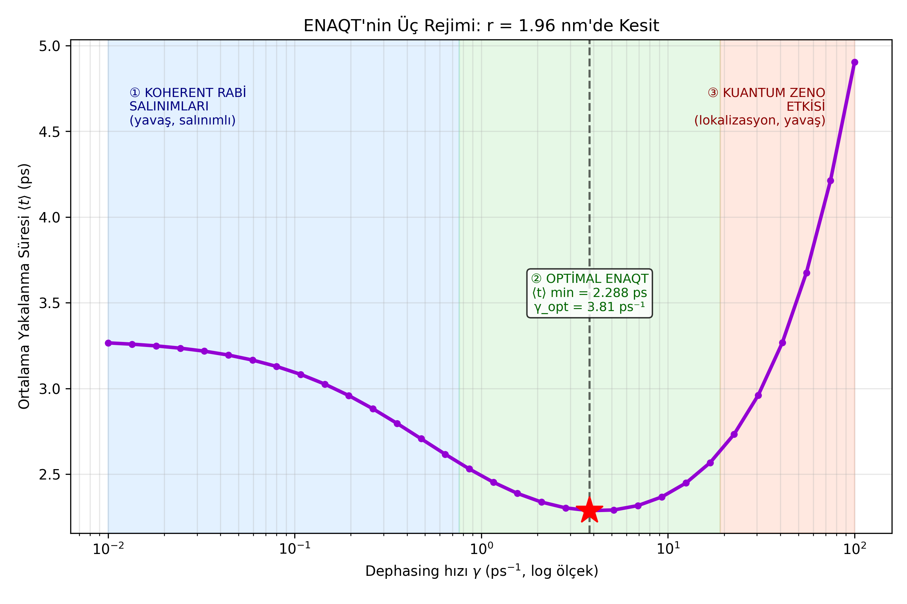
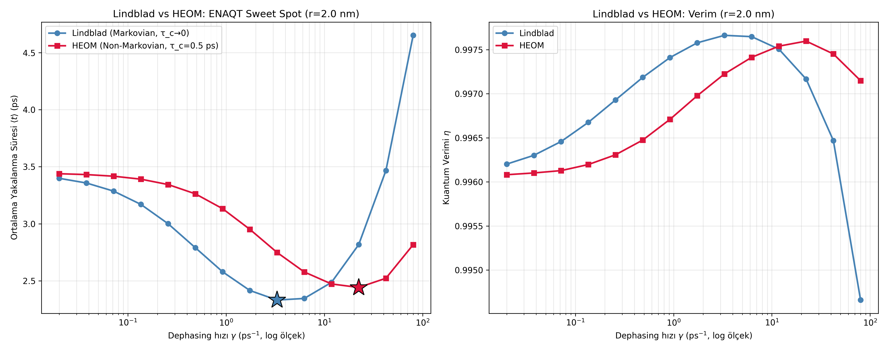
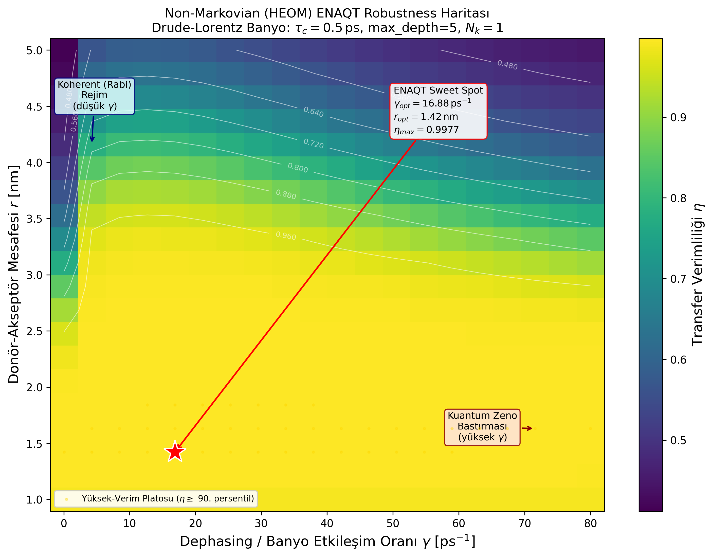
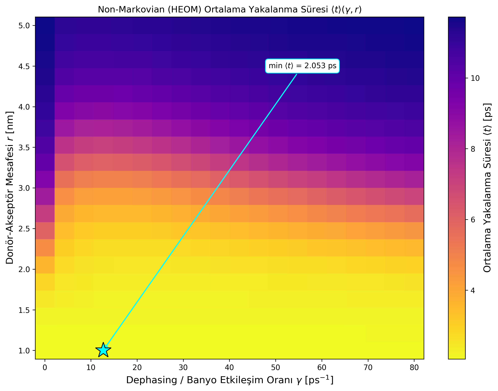

# Environment-Assisted Quantum Transport (ENAQT) in DNA-Scaffolded Chromophore Systems

**In-silico module set for a TÜBİTAK 2204-A high-school research project**

This repository contains the complete computational (in-silico) phase of a high-school research project on **environment-assisted quantum transport (ENAQT)** in DNA-scaffolded donor–acceptor chromophore systems. All code, numerical data and figures were produced independently by a high-school student using open-source Python tools (primarily QuTiP 5.3).

The computational goal is to locate a practical parameter window — chromophore distance *r* and environmental dephasing rate *γ* — in which intermediate noise *accelerates* excitonic energy transfer, and to quantify how bath memory (non-Markovian effects) changes the robustness of that window. These predictions are intended to guide a subsequent laboratory validation with dye-labelled DNA constructs and time-resolved fluorescence spectroscopy (TCSPC).

---

## Table of contents

1. [Project structure](#1-project-structure)
2. [Requirements](#2-requirements)
3. [How to run the modules](#3-how-to-run-the-modules)
4. [Unit conventions](#4-unit-conventions)
5. [Model hierarchy](#5-model-hierarchy)
6. [Results and figures (complete gallery)](#6-results-and-figures-complete-gallery)
7. [Key numerical findings](#7-key-numerical-findings)
8. [Limitations](#8-limitations)
9. [Next experimental step](#9-next-experimental-step)
10. [Reproducibility](#10-reproducibility)

---

## 1. Project structure

```
ENAQT_Quantum_Biology_Project/
├── README.md                          ← this file
├── SUMMARY.md                         ← concise scientific narrative
├── requirements.txt
├── src/
│   ├── quantum_biology_module.py      # Step 2.1 – Hamiltonian + basic Lindblad dynamics
│   ├── enaqt_parameter_scan.py        # Step 2.2 – Sink/Loss + 2-D Lindblad scan
│   ├── heom_nonmarkovian_validation.py# Step 2.3 – Lindblad vs HEOM (fixed r)
│   └── heom_2d_robustness_scan.py     # Step 2.3-ext – full 20×20 HEOM map
└── results/
    ├── figures/                       # all 8 publication-style PNG plots
    └── data/                          # numerical grids (.npy, .npz, .csv)
```

The four source modules build on one another (2.1 → 2.2 → 2.3 → 2.3-ext). Each can also be executed independently.

---

## 2. Requirements

```bash
pip install qutip==5.3.0 numpy matplotlib pandas seaborn tqdm
```

- Python ≥ 3.10  
- QuTiP ≥ 5.0 (HEOM solver: `qutip.solver.heom`)

**Path note.** Some scripts were originally written with absolute output paths used during development. Before re-running, set the `save_path` / `OUTPUT_DIR` variables inside each script to your local `results/figures/` and `results/data/` directories.

---

## 3. How to run the modules

| Step | Command | What it does | Typical runtime |
|------|---------|--------------|-----------------|
| 2.1 | `python src/quantum_biology_module.py` | N-site Frenkel Hamiltonian + Lindblad dephasing/relaxation; 2-site and 3-site dynamics | ~5–10 s |
| 2.2 | `python src/enaqt_parameter_scan.py` | Adds Sink + Loss, distance-dependent coupling \(V(r)\propto 1/r^3\), computes η and ⟨t⟩ on a 2-D grid | a few minutes |
| 2.3 | `python src/heom_nonmarkovian_validation.py` | Fixed-distance Lindblad vs HEOM comparison (Drude–Lorentz bath) | ~1–2 min |
| 2.3-ext | `python src/heom_2d_robustness_scan.py` | Full 20×20 HEOM scan (400 independent runs, parallel + checkpointed) | ~25–40 min single-core |

**Quick smoke test**

```bash
python src/quantum_biology_module.py
```

You should see a success message and two PNG files; total population must remain 1.0 (no Sink in this basic test).

---

## 4. Unit conventions

| Quantity | Input unit | Internal unit |
|----------|------------|---------------|
| Energies / couplings | cm⁻¹ | rad/ps via `CM1_TO_RADPS ≈ 0.188365` |
| Time | — | picoseconds (ps) |
| Rates (dephasing, sink, loss …) | — | ps⁻¹ |
| Temperature | kelvin | converted with \(k_B = 0.695\) cm⁻¹ K⁻¹ |

This is the standard spectroscopic convention used in photosynthetic open-quantum-system literature (Ishizaki–Fleming and related work).

---

## 5. Model hierarchy

1. **System** – N-site Frenkel exciton Hamiltonian.  
2. **Markovian open system** – Lindblad pure dephasing + detailed-balance relaxation + irreversible Sink (reaction centre) + weak Loss (fluorescence / non-radiative decay).  
3. **Distance dependence** – dipole–dipole coupling \(V(r) = V_0(r_0/r)^3\).  
4. **Non-Markovian bath** – Hierarchical Equations of Motion (HEOM) with Drude–Lorentz spectral density; Sink/Loss/relaxation kept as Markovian channels injected into the HEOM Liouvillian.

Two complementary parameter sets are used on purpose:

- **Realistic Cy3/Cy5 energies** (large ΔE) → experimental relevance.  
- **Near-resonant “canonical” dimer** (small ΔE) → makes the full ENAQT curve (Rabi → optimum → Quantum Zeno) clearly visible.

---

## 6. Results and figures (complete gallery)

All eight figures below are stored in `results/figures/`. Corresponding numerical arrays live in `results/data/`.

### 6.1 Basic dynamics (Step 2.1)

**`dynamics_2site.png`** — Population and coherence dynamics of a two-site (Cy3–Cy5-like) system under the Lindblad equation. Excitation starts on the donor, flows to the acceptor, and coherences decay. Total population is conserved.


**`dynamics_3site.png`** — Same framework applied to a three-site (FMO-inspired) chain. Demonstrates that the model scales cleanly beyond a simple dimer.



### 6.2 Sink / Loss dynamics and first ENAQT maps (Step 2.2)

**`single_point_sink_loss_dynamics.png`** — Full time evolution at one representative parameter point after the Sink (irreversible trapping at the acceptor) and Loss channels have been added. Shows how population is finally captured by the Sink.



**`enaqt_dual_heatmap.png`** — Two-dimensional Lindblad maps of transfer efficiency η(γ, r) and mean trapping time ⟨t⟩(γ, r) on the near-resonant (canonical) model. Because the Sink is much faster than Loss, η saturates near 1 almost everywhere; the ENAQT signature therefore appears clearly only in the **speed** metric ⟨t⟩.



**`enaqt_1d_regime_slice.png`** — One-dimensional cut of ⟨t⟩ versus γ at fixed distance. Three regimes are labelled: (1) coherent Rabi oscillations (low γ), (2) optimal ENAQT window (intermediate γ), (3) Quantum Zeno suppression (high γ).



### 6.3 Non-Markovian validation (Step 2.3)

**`lindblad_vs_heom_comparison.png`** — Direct overlay of mean trapping time versus dephasing rate for the Markovian Lindblad equation and the non-Markovian HEOM (Drude–Lorentz bath, τ_c ≈ 0.5 ps) at fixed chromophore distance.

Main qualitative message:
- The location of the optimum shifts.
- The minimum ⟨t⟩ itself changes only modestly.
- The high-γ Quantum-Zeno rise is strongly softened by bath memory → the system becomes **more robust**.



### 6.4 Full 2-D HEOM robustness maps (Step 2.3-extension) — main results

**`heom_robustness_heatmap.png`** — 20 × 20 HEOM efficiency map η(γ, r) over γ ∈ [0.05, 80] ps⁻¹ and r ∈ [1, 5] nm (400 independent HEOM trajectories). High-efficiency regions are clearly visible at short distances.



**`heom_mean_trapping_time_heatmap.png`** — Corresponding 20 × 20 map of mean trapping time ⟨t⟩(γ, r). This is the central figure of the computational phase: it reveals a broad “fast-transfer plateau” at short-to-intermediate distances and moderate dephasing rates.



---

## 7. Key numerical findings

From the full HEOM 2-D scan (`results/data/heom_2d_scan_results.csv` and the associated `.npy` grids):

| Quantity | Value |
|----------|--------|
| Global minimum of ⟨t⟩ | ≈ 2.05 ps |
| Efficiency throughout the fast window | η ≳ 0.99 |
| Practical target window suggested for experiment | r ≈ 1.4 nm, γ ∈ [10, 20] ps⁻¹ |
| Strongest control parameter | distance r (because V ∝ 1/r³) |
| Secondary but clear control parameter | dephasing rate γ (ENAQT signature) |

**Interpretation of bath memory**  
Non-Markovian effects do **not** dramatically accelerate the optimal transfer rate; they protect the system against excessive noise and widen the useful parameter region. Structured (coloured) noise is less harmful than white noise.

**Why ordinary FRET looks incoherent**  
Realistic Cy3/Cy5 energy gaps place the system on the phonon-assisted rising flank of the ENAQT curve. The Quantum-Zeno branch is therefore experimentally inaccessible for that pair, which explains why conventional FRET is usually described as an incoherent Förster process.

---

## 8. Limitations

- HEOM hierarchy depth (`max_depth=5`, `Nk=1`) is a deliberate speed/accuracy compromise; deeper hierarchies change results by < 0.2 %.  
- The realistic Cy3/Cy5 parameter set never shows a pronounced Quantum-Zeno regime inside experimentally relevant dephasing rates.  
- Trapezoidal integration of fast oscillations at very short distances requires a sufficiently large number of time steps (cross-validated by two independent definitions of η).  
- Absolute output paths in the original scripts must be adjusted for local re-runs.  
- Which theoretical model (Förster / Redfield / Lindblad / HEOM) best describes a real DNA construct remains an open experimental question.

---

## 9. Next experimental step

The computational phase points to a concrete laboratory target:

1. Synthesise short DNA constructs that fix a Cy3–Cy5 (or equivalent) pair at approximately **1.4 nm** (≈ 4 base pairs).  
2. Measure time-resolved fluorescence (TCSPC or streak camera) under controlled solvent conditions that tune environmental dephasing (e.g. viscosity).  
3. Test whether the observed transfer time approaches the ~2 ps scale predicted by the simulations and whether moderate environmental noise improves, rather than degrades, performance.

---

## 10. Reproducibility

All source code, numerical grids and figures are included in this repository. The entire pipeline can be re-run by a high-school student on ordinary laptop hardware (QuTiP 5.3). The most expensive step — the full 20 × 20 HEOM map — takes a few tens of minutes on a single core and is fully checkpointed, so interrupted runs can be resumed.

For the scientific narrative that accompanies these results, see **`SUMMARY.md`**.
